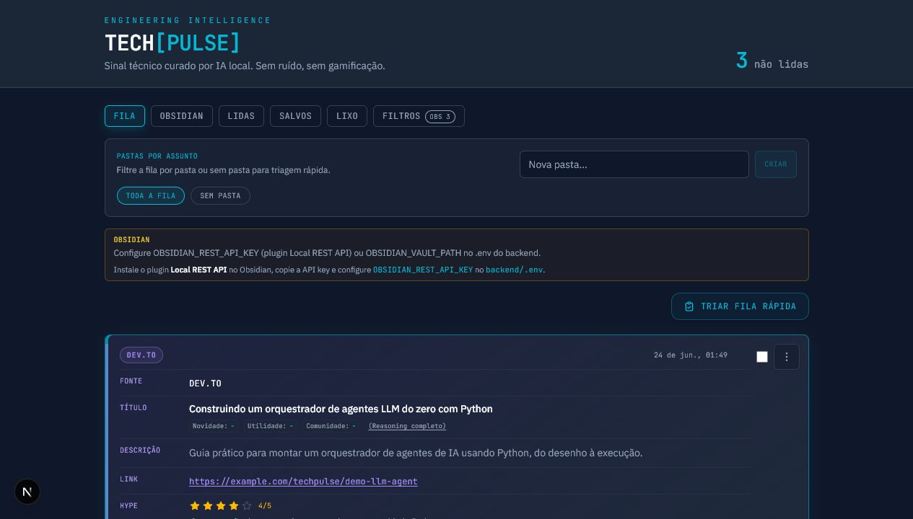

<div align="center">

<!-- Adicione docs/screenshot.png após capturar o dashboard -->

<br/>

# TechPulse

**PT:** Feed de inteligência técnica filtrado por IA local. Zero ruído, só sinal.  
**EN:** Localized, AI-filtered engineering intelligence feed. Zero noise, just signal.

<br/>

[](https://python.org)
[](LICENSE)
[](https://github.com/simoesleandro/Tech-Pulse/commits)
[](https://github.com/simoesleandro/Tech-Pulse/issues)
[](https://fastapi.tiangolo.com)
[](https://nextjs.org)
[](https://ollama.com)

<br/>

[📖 Documentação](system_design.html) &nbsp;·&nbsp;
[🐛 Reportar bug](https://github.com/simoesleandro/Tech-Pulse/issues) &nbsp;·&nbsp;
[💡 Sugerir feature](https://github.com/simoesleandro/Tech-Pulse/issues)

</div>

---

## 📋 Índice / Table of Contents

- [Sobre / About](#-sobre--about)
- [Demo](#-demo)
- [Funcionalidades / Features](#-funcionalidades--features)
- [Stack](#-stack)
- [Instalação / Setup](#-instalação--setup)
- [Uso / Usage](#-uso--usage)
- [Variáveis de Ambiente / Environment Variables](#-variáveis-de-ambiente--environment-variables)
- [Arquitetura / Architecture](#-arquitetura--architecture)
- [Testes / Tests](#-testes--tests)
- [Roadmap](#-roadmap)
- [Autor / Author](#-autor--author)

---

## 📌 Sobre / About

**PT:**  
O TechPulse mitiga a fadiga de informação de engenheiros de software, consolidando canais técnicos (Dev.to, Reddit, GitHub Trends) em um dashboard de alta densidade. Um pipeline de ingestão em background sanitiza, deduplica e classifica cada artigo via Gemma local (Ollama) antes de persistir no SQLite — a navegação no frontend permanece instantânea.

**EN:**  
TechPulse reduces information overload for software engineers by consolidating technical channels (Dev.to, Reddit, GitHub Trends) into a high-density dashboard. A background ingestion pipeline sanitizes, deduplicates, and classifies each article via local Gemma (Ollama) before persisting to SQLite — keeping the frontend browsing experience instant.

---

## 🎯 Demo

> Projeto local — sem deploy público. Clone e rode conforme instruções abaixo.

<details>
<summary>📸 Screenshots</summary>
<br/>

| Dashboard | System Design |
|-----------|---------------|
| Adicione `docs/screenshot-dashboard.png` | Veja [`system_design.html`](system_design.html) |

</details>

---

## ✨ Funcionalidades / Features

> **PT:** O que o projeto faz  
> **EN:** What the project does

- ✅ Ingestão automática de Dev.to, Reddit e GitHub Trends
- ✅ Classificação cognitiva via Ollama (`RELEVANTE` / `LIXO`)
- ✅ API REST FastAPI com filtros, leitura e favoritos
- ✅ Dashboard Next.js slate-dark com feed curado
- ✅ Deduplicação por URL antes da inferência de IA
- 🚧 Deploy em produção *(em desenvolvimento / in progress)*

---

## 🛠 Stack

| Camada / Layer | Tecnologia / Technology |
|----------------|------------------------|
| Backend | FastAPI + SQLAlchemy + Pydantic |
| Frontend | Next.js 16 + Tailwind CSS 4 |
| Banco de dados / Database | SQLite |
| IA / AI | Gemma local via Ollama |
| Deploy | Local (dev) |
| Testes / Tests | Scripts `test_api.py` + `test_ingest.py` |

---

## 🚀 Instalação / Setup

### Pré-requisitos / Prerequisites

- Python 3.11+
- Node.js 20+
- [Ollama](https://ollama.com) com modelo `gemma` instalado (`ollama pull gemma`)

### Instalação / Installation

```bash
# Clone o repositório / Clone the repository
git clone https://github.com/simoesleandro/Tech-Pulse
cd Tech-Pulse

# ── Backend ──
cd backend
python -m venv .venv
# Windows: .\.venv\Scripts\activate
# Linux/macOS: source .venv/bin/activate
pip install -r requirements.txt

# ── Frontend ──
cd ../frontend
npm install
cp .env.local.example .env.local

# ── Variáveis de ambiente (raiz) ──
cd ..
cp .env.example .env
```

---

## 💻 Uso / Usage

### Subir a API

```bash
cd backend
.\.venv\Scripts\uvicorn app.main:app --reload   # Windows
# source .venv/bin/activate && uvicorn app.main:app --reload   # Linux/macOS
```

Swagger: `http://127.0.0.1:8000/docs`

### Subir o dashboard

```bash
cd frontend
npm run dev
```

Abra `http://localhost:3000`

### Disparar ingestão manual

```bash
curl -X POST http://127.0.0.1:8000/api/ingest
```

Ou use o botão **Atualizar feed** no dashboard.

### Load demo data (no Ollama required)

```bash
curl -X POST http://127.0.0.1:8000/api/seed
```

Or click **Load demo data** in the dashboard.

---

## 🔐 Variáveis de Ambiente / Environment Variables

| Variável | Descrição / Description | Padrão / Default |
|----------|------------------------|-----------------|
| `OLLAMA_URL` | Endpoint de geração do Ollama | `http://localhost:11434/api/generate` |
| `OLLAMA_MODEL` | Modelo local para classificação | `gemma` |
| `OLLAMA_TIMEOUT` | Timeout da inferência (segundos) | `60` |
| `INGEST_ON_STARTUP` | Ingerir ao iniciar o backend | `false` |
| `INGEST_BACKGROUND` | Loop de ingestão em background | `false` |
| `INGEST_INTERVAL_SECONDS` | Background loop interval (seconds) | `300` |
| `ALLOW_SEED` | Enable `POST /api/seed` demo endpoint | `true` |
| `NEXT_PUBLIC_API_URL` | API URL for the frontend | `http://localhost:8000` |

> Lista completa em / Full list in: [`.env.example`](.env.example)

---

## 🏗 Arquitetura / Architecture

```
Tech-Pulse/
├── backend/
│   ├── app/
│   │   ├── main.py           # FastAPI, CORS, rotas REST
│   │   ├── models.py         # ORM NewsItem (SQLite)
│   │   ├── schemas.py        # Validação Pydantic
│   │   └── services/         # Scrapers, Ollama, pipeline de ingestão
│   ├── test_api.py           # Testes dos endpoints REST
│   └── test_ingest.py        # Testes do pipeline de ingestão
├── frontend/
│   ├── app/                  # Next.js App Router
│   ├── components/           # Dashboard, cards, filtros
│   └── lib/                  # API client e tipos
├── docs/                     # Screenshots e assets
├── system_design.html        # Documentação de arquitetura e marca
└── README.md
```

**Fluxo principal / Main flow:**

```
Scrapers (dev.to · reddit · github)
      ↓
Deduplicação por URL (SQLite)
      ↓
Classificação Ollama (RELEVANTE / LIXO)
      ↓
Persistência → API REST → Dashboard Next.js
```

---

## 🔄 Backfill (Obsidian + legado)

Endpoints para sincronizar estado antigo com o pipeline atual:

| Endpoint | Descrição |
|----------|-----------|
| `GET /api/backfill/status` | Contadores pendentes |
| `POST /api/backfill/obsidian` | Marca `obsidian_exported_at` para notas já no vault |
| `POST /api/backfill/re-enrich?limit=10` | Reprocessa itens legados em paralelo (tradutor → hype) |

**PowerShell** (não use `curl -X`; use `Invoke-RestMethod`):

```powershell
# Status
Invoke-RestMethod -Uri "http://localhost:8000/api/backfill/status"

# Re-enriquecer até remaining = 0 (~15–25 min com lotes de 10, paralelo)
do {
  $r = Invoke-RestMethod -Method Post -Uri "http://localhost:8000/api/backfill/re-enrich?limit=10"
  $r | Format-List
} while ($r.remaining -gt 0)
```

Itens legados são detectados quando `ai_reasoning` não contém `Novidade` e `Utilidade`. O backfill Obsidian roda no startup do backend; para vault local, defina `OBSIDIAN_VAULT_PATH` no `backend/.env`.

> **Jun/2026:** re-enriquecimento parcial em andamento (~16/30 concluídos). Retomar com o loop acima.

---

## 🧪 Testes / Tests

```bash
cd backend
.\.venv\Scripts\activate   # Windows

# Run pytest suite
pytest

# With verbose output
pytest -v
```

> **10+ scenarios** covering health check, CRUD, filters, bookmark, seed, ingest mocks.

---

## 🗺 Roadmap

- [x] Core backend — SQLite + SQLAlchemy + `NewsItem` model
- [x] REST API FastAPI with CORS
- [x] Ingestion pipeline + Ollama classification
- [x] Next.js slate-dark dashboard
- [x] Pytest suite + GitHub Actions CI
- [x] Demo seed endpoint (`POST /api/seed`)
- [ ] Screenshots in README (`docs/screenshot.png`)
- [ ] Production deploy (Fly.io / Vercel + VPS)

---

## 👤 Autor / Author

<div align="center">

**Leandro Simões**

[](https://linkedin.com/in/leandro-sim%C3%B5es-7a0b3537b)
[](https://github.com/simoesleandro)
[](https://simoesleandro.github.io/portfolio)

*Fullstack · IA Aplicada · Civic Tech*

</div>

---

<div align="center">

Feito com ☕ e IA em / Made with ☕ and AI in 🇧🇷 Rio de Janeiro

</div>
